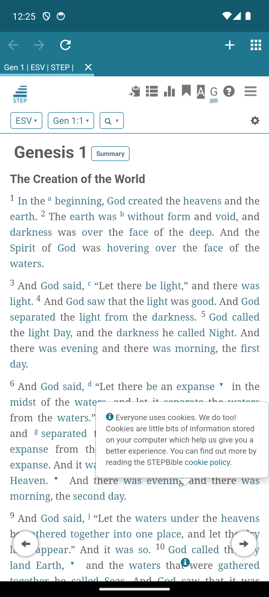
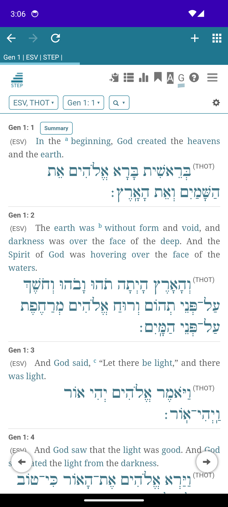
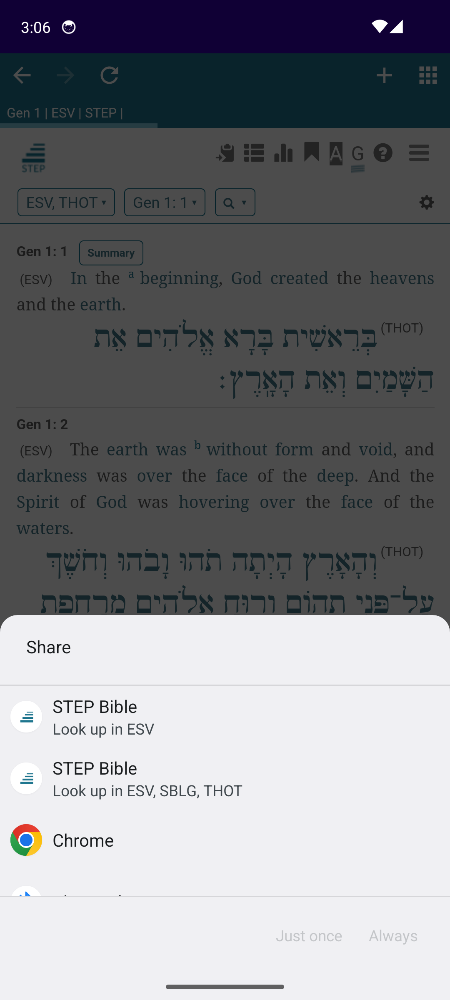
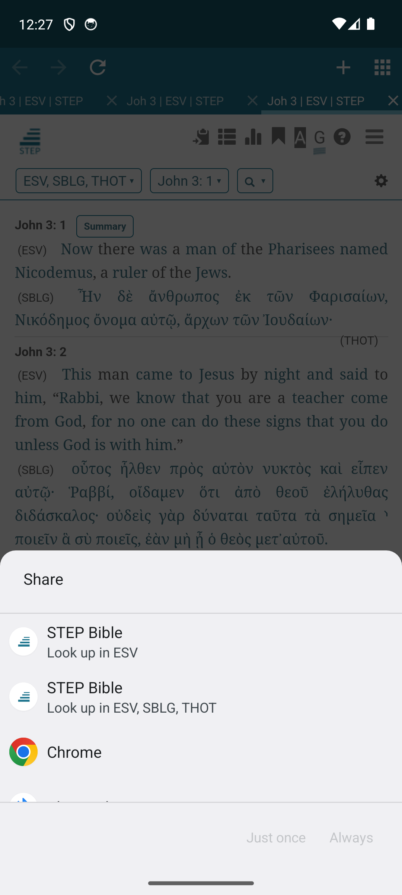

# STEP Bible for Android

[](LICENSE)
[](https://www.android.com)
[](app/build.gradle.kts)
[](app/build.gradle.kts)
[](app/build.gradle.kts)

Native Android wrapper for [STEP Bible](https://www.stepbible.org/) — embeds the full STEP Bible server (Jetty + JVM) inside the app and renders it through a tabbed WebView UI.

<p align="center">
  
  
  
  
</p>

## Table of Contents

- [Requirements](#requirements)
- [Features](#features)
- [Tech stack](#tech-stack)
- [Architecture](#architecture)
- [Build](#build)
- [Tests](#tests)
- [Project structure](#project-structure)
- [Known limitations](#known-limitations)
- [Contributing](#contributing)
- [License](#license)
- [Acknowledgments](#acknowledgments)

## Requirements

- **Android 8.0+** (API 26, minSdk) — Android 14 (API 34, targetSdk)
- **~250 MB** free storage for the bundled JRE and STEP Bible data (extracted on first launch)
- **Internet** only for initial downloads — the app works fully offline after setup
- **Permissions:** `INTERNET` (local server communication)

## Features

- **Embedded STEP Bible server** — Bundles the STEP Bible Jetty server via JNI + JVM; works offline after initial setup
- **Tabbed browsing** — Open multiple passages simultaneously with a desktop-style tab bar
- **Tab overview** — Grid view of all open tabs with live WebView thumbnails
- **Share-to-lookup** — Select any Bible reference from another app and open it directly in STEP via "Look up in ESV" or "Look up in ESV, SBLG, THOT" share targets
- **Dark theme** — Automatic DayNight theme with WebView `FORCE_DARK` support
- **Session persistence** — Tabs and navigation state survive process death and rotation
- **Navigation controls** — Back/forward with long-press history popup, reload
- **File downloads** — Download via Android `DownloadManager`
- **Multi-architecture** — Ships JRE for both `arm64-v8a` and `x86_64`

## Tech stack

| Layer | Technology |
|-------|-----------|
| Language | Kotlin + C (JNI stub) |
| UI | Android Views, WebView, Material Components |
| Build | Gradle Kotlin DSL, CMake (native) |
| Server | Embedded Jetty inside JVM 17 (PojavLauncher JRE) |
| JavaScript | Kotlin `@JavascriptInterface` bridge |
| Minification | R8 / ProGuard |
| Native libs | CMake + NDK 27 |

## Architecture

```
┌──────────────────────────────────────┐
│  Kotlin App (MainActivity)           │
│  ┌────────────────────────────────┐  │
│  │  WebView UI (tabbed browser)   │  │
│  ├────────────────────────────────┤  │
│  │  C JNI Stub (step_jvm_stub)    │  │
│  ├────────────────────────────────┤  │
│  │  JVM (PojavLauncher JRE 17)    │  │
│  ├────────────────────────────────┤  │
│  │  Jetty Server (STEP Bible)     │  │
│  └────────────────────────────────┘  │
└──────────────────────────────────────┘
```

The C JNI stub (`app/src/main/jni/step_jvm_stub.c`) loads `libjvm.so` from the bundled JRE, creates a JVM instance, and starts the STEP Bible Jetty server. The Kotlin frontend polls for server readiness, then loads the local server URL in a tabbed WebView.

## Build

### Prerequisites

- Linux (or macOS with modifications)
- ~4 GB free disk space (JDK, Android SDK, JRE, STEP data)
- Android 8.0+ emulator or device for testing

### Quick build

```bash
./build.sh build
```

This downloads **JDK 21**, **Android SDK**, **JRE 17** (PojavLauncher), the latest **STEP Bible .deb**, extracts everything, compiles the Java bootstrap, and produces a debug APK at `app/build/outputs/apk/debug/`.

### Phased build

```bash
./build.sh setup        # Install JDK, Android SDK, Gradle
./build.sh download     # Download STEP .deb and JRE tarballs
./build.sh extract      # Extract assets into app/src/main/assets/
./build.sh build        # Compile and package APK
```

### Run on emulator

```bash
./build.sh setup
./build.sh system-image  # Download Android 34 x86_64 system image
./build.sh build
./build.sh run           # Start emulator, install APK, launch app
```

### Clean

```bash
./build.sh clean
```

## Tests

```bash
./gradlew :app:testDebugUnitTest
```

Unit tests cover Bible reference parsing (`parseReference`, `extractBibleReference`) and URL rewriting (`rebuildUrl`). Tests are written with JUnit 4 and located in `app/src/test/`.

## Project structure

```
├── app/
│   ├── src/
│   │   ├── main/
│   │   │   ├── java/com/eratverbum/stepbible/
│   │   │   │   ├── MainActivity.kt          # Tabbed WebView browser UI + server lifecycle
│   │   │   │   ├── JVMStub.kt              # Native JVM loader binding (JNI)
│   │   │   │   ├── TarExtractor.kt         # First-launch asset extraction from APK
│   │   │   │   └── ServerState.kt           # Global server state holder
│   │   │   ├── jni/
│   │   │   │   ├── step_jvm_stub.c         # C JNI: loads libjvm, starts Jetty
│   │   │   │   └── CMakeLists.txt
│   │   │   ├── res/                        # Layouts, themes, drawables, colors
│   │   │   └── AndroidManifest.xml
│   │   └── test/                           # Unit tests (JUnit 4)
│   └── build.gradle.kts
├── step-bootstrap/                          # Java bootstrap for STEP server
├── build.sh                                 # One-click build script
├── docs/screenshots/                        # App screenshots
└── README.md
```

## Known limitations

- **Only ASCII book names** — The `extractBibleReference` regex matches `[A-Z][a-z]+`, so non-ASCII (e.g., "Génesis") and all-lowercase (e.g., "john 3:16") book names are not recognized
- **First reference only** — Only the first Bible reference in the shared text is extracted; additional references are ignored
- **Multi-word book names** — Books with internal lowercase words (e.g., "Song of Solomon") may produce inaccurate results from `extractBibleReference`
- **No server restart** — If the embedded JVM crashes while the app is in the foreground, the app must be restarted (closing the process)
- **Single-architecture build** — Both `arm64-v8a` and `x86_64` JREs are shipped (not armeabi-v7a)

## Contributing

Bug reports and pull requests are welcome. When reporting issues, please include:

- Android version and device/emulator model
- Steps to reproduce
- Relevant logcat output

## License

This project is licensed under the **BSD 3-Clause License** — see [LICENSE](LICENSE).

STEP Bible software is [BSD 3-Clause](https://stepbibleguide.blogspot.com/p/copyrights-licences.html) licensed (© Tyndale House / STEPBible.org).

## Acknowledgments

- **[STEP Bible](https://www.stepbible.org/)** — The open-source Bible study platform by Tyndale House and STEPBible.org
- **[PojavLauncher](https://github.com/PojavLauncherTeam/android-openjdk-build-multiarch)** — JRE builds for Android
- **[CrossWire Bible Society](https://www.crosswire.org/)** — JSword library and Bible modules
